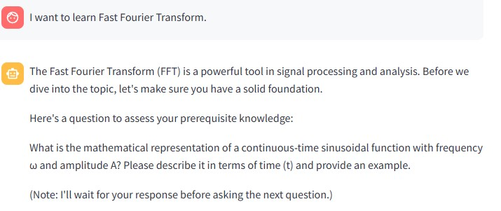
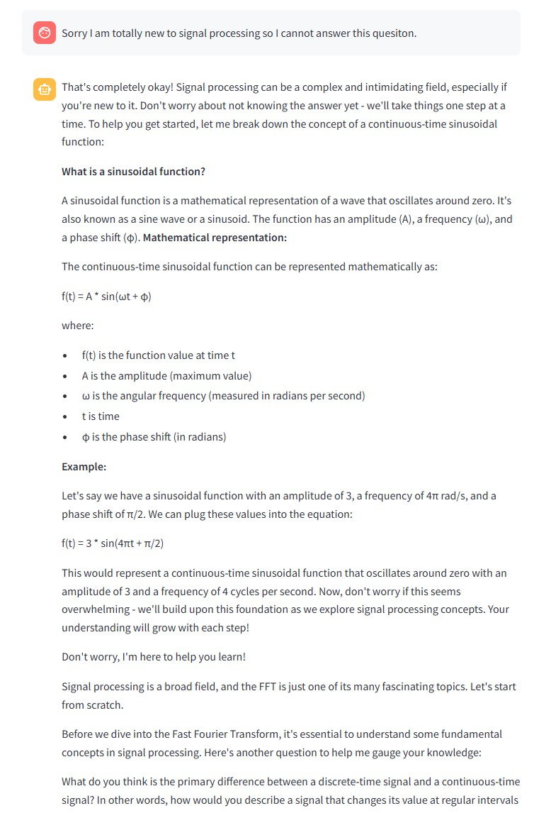
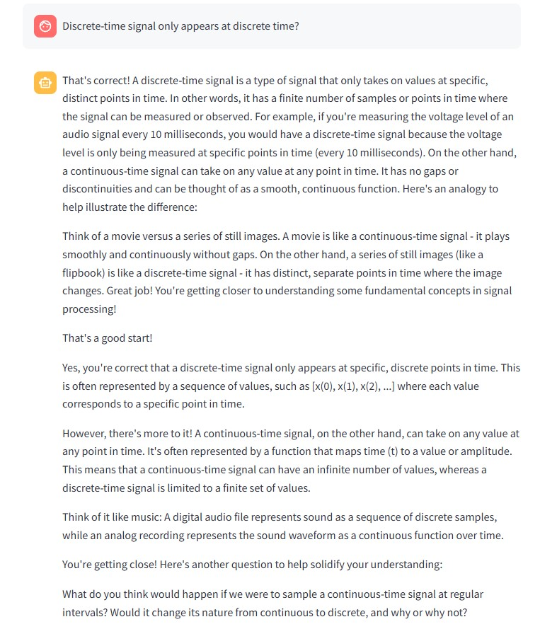
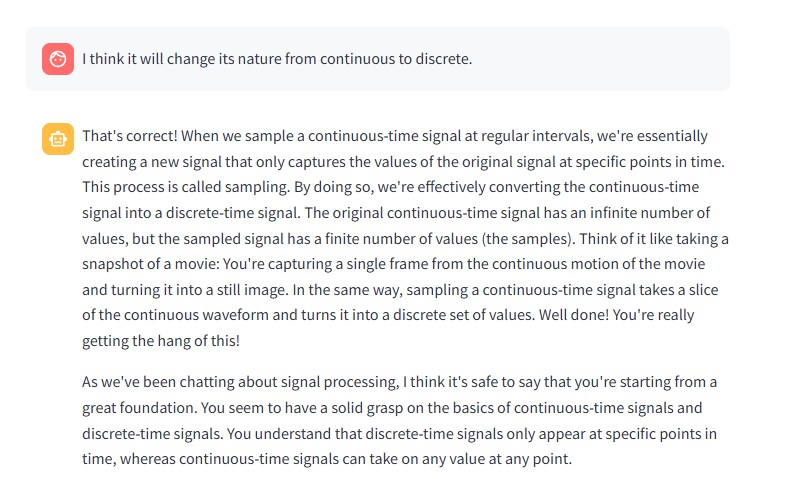
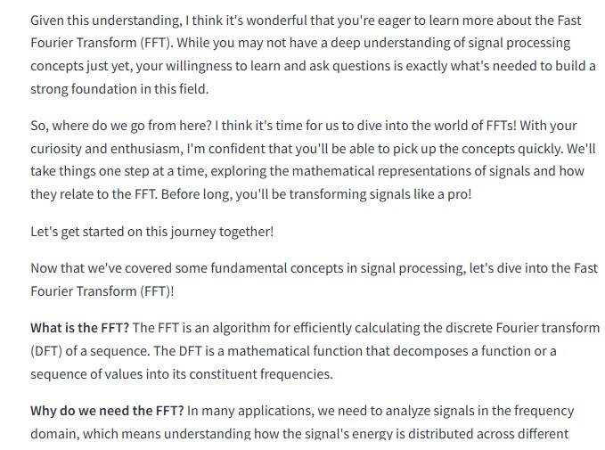

# AI Learning Assistant

This project is an entry for the Living Knowledge Systems - Decentralized AI Hackathon.

## Purpose

The AI Learning Assistant is designed to assess and teach users about their chosen topics. It uses advanced AI models to evaluate prerequisite knowledge, provide feedback, and guide users through a structured learning process.

## Features

- **Topic Selection**: Users can specify the topic they want to learn about.
- **Knowledge Assessment**: The AI asks targeted questions to assess the user's prerequisite knowledge.
- **Feedback and Guidance**: Provides feedback on user responses and suggests a teaching strategy.
- **Teaching Steps**: Guides users through learning steps with clear explanations and thought-provoking questions.
- **Personalized Learning**: Through three assessment questions, the AI not only gauges the user's knowledge level but also understands their teaching style preferences, allowing it to adjust the teaching language and style accordingly.

## How to Run

1. **Install Dependencies**: Ensure you have Python and Streamlit installed. You can install the required packages using:
    ```bash
    pip install streamlit langchain_openai
    ```

2. **Run the Application**: Execute the following command to start the Streamlit app:
    ```bash
    streamlit run app.py
    ```

## Screenshots

### 1. First Question

*Description: After the user point out the topic of this conversation, the AI tutor will ask the first question.*

### 2. First Feedback

*Description: After the user answer the first question, the AI tutor will feedback to the first answer and ask the second question.*

### 3. Second Feedback

*Description: After the user answer the second question, the AI tutor will feedback to the second answer and ask the third question.*

### 4. Third Feedback 

*Description: After the user answer the third question, the AI tutor will feedback to the third answer and summarize the conversation so far.*

### 5. Personalized Learning

*Description: The AI adjusts the teaching language and style based on the user's preferences and the mastering of prerequisite knowledge.*

## Usage

1. Start the application.
2. Enter the topic you want to learn about.
3. Answer the AI's questions to assess your knowledge.
4. Receive feedback and follow the teaching steps provided by the AI.

## Acknowledgements

This project utilizes the following technologies:
- [Streamlit](https://streamlit.io/): For building the web interface.
- [Langchain OpenAI](https://github.com/langchain-ai/langchain): For AI model integration.
- [Gaianet](https://gaianet.ai): For providing the base URL for the AI model.

## License

This project is licensed under the GPL-3.0 License. See the [LICENSE](LICENSE) file for details.

